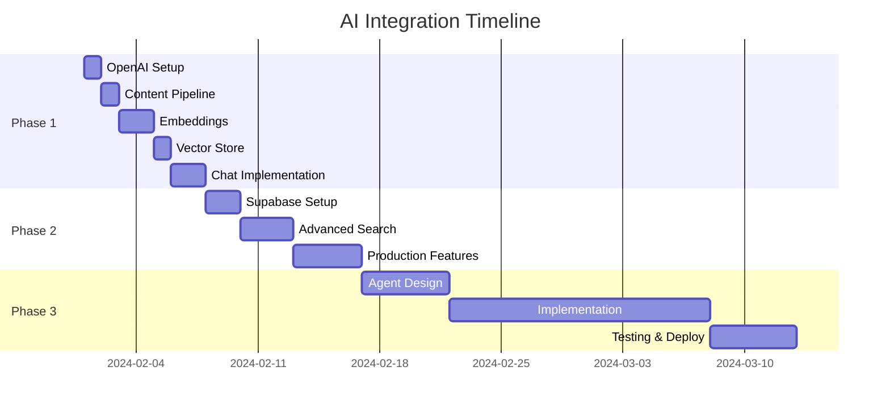

# Zadania implementacji integracji AI - Breakdown

Ten dokument rozpisuje zadania z pliku AI_INTEGRATION_RECOMMENDATIONS.md na atomowe kroki z metrykami sukcesu.

## Faza 1: Naive RAG (2-3 dni)

### 1.1 Setup OpenAI API
**Zadanie:** Konfiguracja OpenAI API i podstawowych zależności

**Kroki atomowe:**
- [ ] Dodaj klucz OpenAI API do zmiennych środowiskowych Vercel
- [ ] Zainstaluj pakiet `openai` (npm install openai)
- [ ] Stwórz plik konfiguracyjny `/lib/openai.ts`
- [ ] Napisz helper do sprawdzania dostępności API

**Metryki sukcesu:**
- API key jest dostępny w `process.env.OPENAI_API_KEY`
- Test connection zwraca status 200
- Możliwość wygenerowania testowego embeddingu

**Walidacja:**
```bash
# Test endpoint
curl https://hretheum.com/api/test/openai-status

# Oczekiwany rezultat:
{
  "status": "connected",
  "model": "gpt-4-turbo-preview",
  "embeddingModel": "text-embedding-3-small"
}
```

### 1.2 Content Extraction Pipeline
**Zadanie:** Stworzenie pipeline do ekstrakcji danych z CMS

**Kroki atomowe:**
- [ ] Endpoint `/api/ai/extract` do pobierania wszystkich danych CMS
- [ ] Funkcja agregująca dane z wszystkich typów (work, timeline, experiments, leadership, contact)
- [ ] Normalizacja formatu danych
- [ ] Cache extracted data w Redis z TTL 1h

**Metryki sukcesu:**
- Endpoint zwraca wszystkie dane w ujednoliconym formacie
- Czas odpowiedzi < 500ms dla cache hit
- Struktura danych zawiera: id, type, title, content, metadata

**Walidacja:**
```typescript
// Test struktura danych
interface ExtractedContent {
  id: string;
  type: 'work' | 'timeline' | 'experiment' | 'leadership' | 'contact';
  title: string;
  content: string; // Połączony tekst
  metadata: {
    date?: string;
    tags?: string[];
    technologies?: string[];
    featured?: boolean;
  };
}

// Endpoint test
const response = await fetch('/api/ai/extract');
const data = await response.json();
assert(data.items.length > 0);
assert(data.items[0].content.length > 100);
```

### 1.3 Text Chunking Strategy
**Zadanie:** Implementacja strategii dzielenia tekstu na chunks

**Kroki atomowe:**
- [ ] Funkcja `chunkText()` z max 512 tokenów per chunk
- [ ] Overlap 50 tokenów między chunks
- [ ] Zachowanie kontekstu (metadata) dla każdego chunk
- [ ] Unit testy dla edge cases

**Metryki sukcesu:**
- Żaden chunk nie przekracza 512 tokenów
- Overlap zachowany między kolejnymi chunks
- Chunks zachowują czytelność (nie łamią zdań w środku)
- 95% pokrycie testami

**Walidacja:**
```typescript
// Test chunking
const text = "Lorem ipsum..."; // 1000 tokens
const chunks = chunkText(text, { maxTokens: 512, overlap: 50 });

assert(chunks.every(c => countTokens(c.text) <= 512));
assert(chunks.length >= 2);
assert(chunks[0].text.slice(-50) === chunks[1].text.slice(0, 50));
```

### 1.4 Embedding Generation
**Zadanie:** Generowanie i przechowywanie embeddingów

**Kroki atomowe:**
- [ ] Endpoint `/api/ai/prepare` do generowania embeddingów
- [ ] Batch processing (max 100 chunks per request)
- [ ] Progress tracking dla długich operacji
- [ ] Error handling i retry logic

**Metryki sukcesu:**
- Wszystkie chunks mają wygenerowane embeddingi
- Koszt < $0.05 per pełne przetworzenie portfolio
- Czas przetwarzania < 30s dla całego contentu
- 0% utraconych chunks przy błędach

**Walidacja:**
```typescript
// Test embedding generation
const response = await fetch('/api/ai/prepare', { method: 'POST' });
const result = await response.json();

assert(result.success === true);
assert(result.processedChunks > 0);
assert(result.failedChunks === 0);
assert(result.totalCost < 0.05);
```

### 1.5 In-Memory Vector Store
**Zadanie:** Implementacja lokalnego vector store

**Kroki atomowe:**
- [ ] Wybór biblioteki (vectra lub hnswlib-node)
- [ ] Klasa `VectorStore` z metodami: add, search, remove
- [ ] Indeksowanie po metadata (type, date)
- [ ] Persistence do Redis jako backup

**Metryki sukcesu:**
- Search time < 50ms dla 1000 wektorów
- Recall@10 > 0.9 dla testowych zapytań
- Memory usage < 100MB
- Auto-save do Redis co 5 minut

**Walidacja:**
```typescript
// Test vector search
const store = new VectorStore();
await store.loadFromRedis();

const results = await store.search("AI projects", { topK: 5 });
assert(results.length === 5);
assert(results[0].score > 0.7);
assert(results[0].metadata.type === 'experiment');
```

### 1.6 Semantic Search Implementation
**Zadanie:** Implementacja semantic search z kontekstem

**Kroki atomowe:**
- [ ] Funkcja `searchSimilar()` z query embedding
- [ ] Cosine similarity calculation
- [ ] Post-processing wyników (deduplication, reranking)
- [ ] Context window building (max 2000 tokens)

**Metryki sukcesu:**
- Relevantne wyniki w top 3 dla 90% zapytań testowych
- Czas wyszukiwania < 100ms
- Context nie przekracza token limit
- Brak duplikatów w wynikach

**Walidacja:**
```typescript
// Test queries
const testQueries = [
  { query: "AI projects", expectedType: "experiment" },
  { query: "team management", expectedType: "leadership" },
  { query: "contact info", expectedType: "contact" }
];

for (const test of testQueries) {
  const results = await searchSimilar(test.query);
  assert(results[0].type === test.expectedType);
}
```

### 1.7 Chat Endpoint with Streaming
**Zadanie:** Endpoint czatu z streaming responses

**Kroki atomowe:**
- [ ] `/api/ai/chat` z Server-Sent Events
- [ ] System prompt z personality Eryk AI
- [ ] Context injection do prompts
- [ ] Token usage tracking

**Metryki sukcesu:**
- First token latency < 1s
- Streaming działa płynnie bez przerw
- Odpowiedzi są spójne z kontekstem
- Token usage raportowany w response

**Walidacja:**
```typescript
// Test streaming chat
const response = await fetch('/api/ai/chat', {
  method: 'POST',
  body: JSON.stringify({ message: "Tell me about your AI projects" })
});

const reader = response.body.getReader();
let fullResponse = '';
let tokenCount = 0;

while (true) {
  const { done, value } = await reader.read();
  if (done) break;
  fullResponse += new TextDecoder().decode(value);
  tokenCount++;
}

assert(fullResponse.includes('experiment'));
assert(tokenCount > 0);
```

### 1.8 React Chat Component
**Zadanie:** Komponent czatu w React

**Kroki atomowe:**
- [ ] `<ErykChat />` component z Framer Motion
- [ ] Message history z localStorage
- [ ] Typing indicators i loading states
- [ ] Error handling z retry
- [ ] Markdown rendering dla odpowiedzi

**Metryki sukcesu:**
- Smooth animations (60 FPS)
- Messages persist po reload
- Graceful error handling
- Responsive design (mobile + desktop)

**Walidacja:**
```typescript
// Component tests
import { render, fireEvent, waitFor } from '@testing-library/react';

test('ErykChat sends and receives messages', async () => {
  const { getByPlaceholderText, getByText } = render(<ErykChat />);
  
  const input = getByPlaceholderText(/zapytaj o projekty/i);
  fireEvent.change(input, { target: { value: 'Test message' } });
  fireEvent.submit(input.closest('form'));
  
  await waitFor(() => {
    expect(getByText(/Test message/)).toBeInTheDocument();
  });
});
```

### 1.9 Integration with Contact Section
**Zadanie:** Integracja czatu z sekcją Contact

**Kroki atomowe:**
- [ ] Podmiana "AI Interview Coming Soon" na działający czat
- [ ] Smooth modal transitions
- [ ] Mobile-friendly layout
- [ ] Analytics events

**Metryki sukcesu:**
- Modal otwiera się w < 200ms
- Działa na wszystkich breakpoints
- Analytics rejestruje otwarcia czatu
- Brak layout shifts

**Walidacja:**
```typescript
// Integration test
cy.visit('/');
cy.scrollTo('bottom');
cy.contains('Start AI Conversation').click();
cy.get('[data-testid="eryk-chat"]').should('be.visible');
cy.get('input[placeholder*="projekty"]').type('Hello');
cy.get('form').submit();
cy.contains('Eryk AI', { timeout: 5000 });
```

### 1.10 Monitoring & Analytics
**Zadanie:** Setup monitoringu i analytics

**Kroki atomowe:**
- [ ] Endpoint `/api/ai/metrics` z statystykami
- [ ] Logowanie: queries, response time, token usage
- [ ] Daily cost tracking
- [ ] User satisfaction widget (helpful/not helpful)

**Metryki sukcesu:**
- Wszystkie interakcje są logowane
- Dashboard pokazuje real-time stats
- Daily cost alert przy > $5
- Response satisfaction > 80%

**Walidacja:**
```typescript
// Metrics test
const metrics = await fetch('/api/ai/metrics').then(r => r.json());

assert(metrics.totalQueries > 0);
assert(metrics.avgResponseTime < 2000);
assert(metrics.dailyCost < 5);
assert(metrics.satisfactionRate > 0.8);
```

## Faza 2: Production RAG (1-2 tygodnie)

### 2.1 Supabase Setup with pgvector
**Zadanie:** Konfiguracja Supabase z pgvector

**Kroki atomowe:**
- [ ] Utworzenie projektu Supabase
- [ ] Enable pgvector extension
- [ ] Schema creation dla embeddings
- [ ] Migration istniejących danych

**Metryki sukcesu:**
- pgvector extension aktywny
- Tabela embeddings z proper indexes
- Wszystkie dane zmigrated
- Query performance < 100ms

**Walidacja:**
```sql
-- Test pgvector
SELECT COUNT(*) FROM embeddings;
SELECT * FROM embeddings 
ORDER BY embedding <-> '[0.1, 0.2, ...]' 
LIMIT 5;

-- Performance check
EXPLAIN ANALYZE SELECT ...
```

### 2.2 Automatic Embedding Updates
**Zadanie:** Webhooks dla auto-update embeddingów

**Kroki atomowe:**
- [ ] Webhook endpoint `/api/webhooks/content-update`
- [ ] Queue system dla batch processing
- [ ] Incremental updates (tylko zmienione)
- [ ] Failure recovery

**Metryki sukcesu:**
- Update latency < 5s po CMS save
- 0% missed updates
- Idempotent operations
- Automatic retry przy failures

**Walidacja:**
```typescript
// Webhook test
await updateCMSContent({ id: '123', title: 'Updated' });
await sleep(5000);

const embedding = await supabase
  .from('embeddings')
  .select('*')
  .eq('content_id', '123')
  .single();

assert(embedding.updated_at > Date.now() - 6000);
```

### 2.3 Advanced Chunking Strategy
**Zadanie:** Ulepszona strategia chunking

**Kroki atomowe:**
- [ ] Semantic chunking (granice na paragrafach)
- [ ] Dynamic chunk size (200-512 tokens)
- [ ] Metadata preservation
- [ ] Cross-reference chunks

**Metryki sukcesu:**
- Chunks są semantycznie spójne
- Average chunk size ~350 tokens
- Metadata kompletne dla każdego chunk
- Cross-references działają

**Walidacja:**
```typescript
// Semantic chunking test
const chunks = await semanticChunk(longDocument);

// Check semantic boundaries
chunks.forEach(chunk => {
  assert(chunk.text.endsWith('.') || chunk.text.endsWith('!'));
  assert(chunk.text.split('.').length > 1);
});
```

### 2.4 Hybrid Search Implementation
**Zadanie:** Hybrid search (vector + keyword)

**Kroki atomowe:**
- [ ] Full-text search setup w Supabase
- [ ] BM25 scoring implementation
- [ ] Score fusion algorithm
- [ ] A/B testing framework

**Metryki sukcesu:**
- Hybrid search recall > vector-only by 15%
- Keyword matches boost relevant results
- A/B test pokazuje improvement
- Latency < 150ms

**Walidacja:**
```typescript
// Hybrid search test
const vectorResults = await vectorSearch(query);
const hybridResults = await hybridSearch(query);

// Hybrid should find more relevant results
assert(hybridResults[0].score > vectorResults[0].score);
assert(hybridResults.filter(r => r.score > 0.7).length > 
       vectorResults.filter(r => r.score > 0.7).length);
```

### 2.5 Query Enhancement
**Zadanie:** Query expansion i optimization

**Kroki atomowe:**
- [ ] Synonym expansion
- [ ] Query rewriting dla clarity
- [ ] Intent detection
- [ ] Multi-query generation

**Metryki sukcesu:**
- Expanded queries znajdą 20% więcej relevant results
- Intent detection accuracy > 85%
- Multi-query improves recall
- No latency increase

**Walidacja:**
```typescript
// Query enhancement test
const original = "AI stuff";
const enhanced = await enhanceQuery(original);

assert(enhanced.includes("artificial intelligence"));
assert(enhanced.includes("machine learning"));
assert(enhanced.intent === "technology");
```

### 2.6 Reranking Pipeline
**Zadanie:** Cross-encoder reranking

**Kroki atomowe:**
- [ ] Setup cross-encoder model
- [ ] Rerank top-20 results
- [ ] Score calibration
- [ ] Performance optimization

**Metryki sukcesu:**
- Reranking improves NDCG by 10%
- Top-3 precision > 90%
- Reranking time < 200ms
- GPU utilization < 50%

**Walidacja:**
```typescript
// Reranking test
const initial = await search(query, { topK: 20 });
const reranked = await rerank(query, initial);

// Check order improvement
assert(reranked[0].relevance > initial[0].relevance);
assert(calculateNDCG(reranked) > calculateNDCG(initial));
```

### 2.7 Redis Cache Layer
**Zadanie:** Cache layer dla embeddings i results

**Kroki atomowe:**
- [ ] Cache embedding results (TTL 24h)
- [ ] Cache search results (TTL 1h)
- [ ] Cache invalidation strategy
- [ ] Memory management

**Metryki sukcesu:**
- Cache hit rate > 60%
- Response time reduction 80% for cached
- Memory usage < 500MB
- Automatic cleanup działa

**Walidacja:**
```typescript
// Cache test
const firstCall = await timedSearch(query);
const secondCall = await timedSearch(query);

assert(secondCall.time < firstCall.time * 0.2);
assert(secondCall.cached === true);
```

### 2.8 Enhanced Context Builder
**Zadanie:** Inteligentny context builder

**Kroki atomowe:**
- [ ] Diversity w context (różne types)
- [ ] Temporal relevance (newer = better)
- [ ] Deduplication algorithm
- [ ] Token budget management

**Metryki sukcesu:**
- Context zawiera różne perspektywy
- Recent content prioritized
- No duplicate information
- Always within token limit

**Walidacja:**
```typescript
// Context builder test
const context = await buildContext(query, searchResults);

const types = [...new Set(context.chunks.map(c => c.type))];
assert(types.length >= 2);
assert(context.totalTokens <= 2000);
assert(context.chunks[0].date > context.chunks[3].date);
```

### 2.9 Function Calling Setup
**Zadanie:** GPT-4 function calling dla structured data

**Kroki atomowe:**
- [ ] Define functions schema
- [ ] Implement function handlers
- [ ] Error handling
- [ ] Response formatting

**Metryki sukcesu:**
- Function calls success rate > 95%
- Structured data extraction works
- Graceful fallback przy errors
- Type safety maintained

**Walidacja:**
```typescript
// Function calling test
const response = await chatWithFunctions("Show my timeline");

assert(response.functionCalls.length > 0);
assert(response.functionCalls[0].name === 'getTimeline');
assert(Array.isArray(response.functionCalls[0].result));
```

### 2.10 Production Monitoring
**Zadanie:** Comprehensive monitoring setup

**Kroki atomowe:**
- [ ] Sentry integration dla errors
- [ ] Prometheus metrics
- [ ] Custom dashboards
- [ ] Alert system

**Metryki sukcesu:**
- All errors captured w Sentry
- Metrics dashboard real-time
- Alerts fire within 1 minute
- P99 latency tracked

**Walidacja:**
```typescript
// Monitoring test
// Trigger test error
await fetch('/api/ai/chat', {
  body: JSON.stringify({ message: 'TRIGGER_ERROR_TEST' })
});

// Check Sentry
const sentryEvents = await checkSentry();
assert(sentryEvents.find(e => e.message.includes('TEST')));

// Check metrics
const metrics = await getMetrics();
assert(metrics.errorRate > 0);
```

## Faza 3: Advanced Multi-Agent System (1 miesiąc+)

### 3.1 Agent Architecture Design
**Zadanie:** Design multi-agent architecture

**Kroki atomowe:**
- [ ] Define agent interfaces
- [ ] Communication protocol
- [ ] State management
- [ ] Agent registry

**Metryki sukcesu:**
- Clean separation of concerns
- Agents can communicate
- State persists between calls
- Easy to add new agents

**Walidacja:**
```typescript
// Agent architecture test
const registry = new AgentRegistry();
registry.register(new SearchAgent());
registry.register(new AnalystAgent());

const result = await registry.process({
  query: "Analyze my AI projects",
  context: {}
});

assert(result.agents.length === 2);
assert(result.finalResponse.length > 0);
```

### 3.2 Search Agent Implementation
**Zadanie:** Specialized search agent

**Kroki atomowe:**
- [ ] Query understanding module
- [ ] Multi-strategy search
- [ ] Result aggregation
- [ ] Confidence scoring

**Metryki sukcesu:**
- Understands complex queries
- Uses appropriate search strategy
- Aggregates from multiple sources
- Confidence scores accurate

**Walidacja:**
```typescript
// Search agent test
const agent = new SearchAgent();
const result = await agent.process({
  query: "projects involving both AI and UX"
});

assert(result.strategy === 'hybrid');
assert(result.sources.includes('experiments'));
assert(result.sources.includes('work'));
assert(result.confidence > 0.8);
```

### 3.3 Analyst Agent Implementation
**Zadanie:** Deep analysis agent

**Kroki atomowe:**
- [ ] Project analysis logic
- [ ] Pattern detection
- [ ] Insight generation
- [ ] Recommendation engine

**Metryki sukcesu:**
- Generates non-obvious insights
- Finds patterns across projects
- Recommendations are actionable
- Analysis is comprehensive

**Walidacja:**
```typescript
// Analyst agent test
const agent = new AnalystAgent();
const result = await agent.analyze({
  projects: ['hireverse', 'portfolio', 'experiments']
});

assert(result.insights.length > 3);
assert(result.patterns.includes('AI-focus'));
assert(result.recommendations.length > 0);
```

### 3.4 Eryk Personality Agent
**Zadanie:** Personality and tone agent

**Kroki atomowe:**
- [ ] Personality model
- [ ] Tone variations (diplomatic/direct/sarcastic)
- [ ] Context-aware responses
- [ ] Consistency maintenance

**Metryki sukcesu:**
- Personality consistent across conversations
- Tone appropriate to context
- Memorable interactions
- User engagement increased

**Walidacja:**
```typescript
// Personality test
const agent = new ErykAgent();

const formal = await agent.respond({
  message: "Tell me about yourself",
  tone: "professional"
});

const casual = await agent.respond({
  message: "Tell me about yourself",
  tone: "casual"
});

assert(formal.tone !== casual.tone);
assert(both include core facts);
```

### 3.5 Orchestrator Implementation
**Zadanie:** Central orchestration agent

**Kroki atomowe:**
- [ ] Request routing logic
- [ ] Agent coordination
- [ ] Result synthesis
- [ ] Fallback strategies

**Metryki sukcesu:**
- Routes to correct agents 95%
- Coordinates multi-agent flows
- Synthesizes coherent response
- Handles failures gracefully

**Walidacja:**
```typescript
// Orchestrator test
const orchestrator = new Orchestrator();
const response = await orchestrator.handle({
  query: "Analyze my experience and suggest next career move"
});

assert(response.agentsUsed.includes('search'));
assert(response.agentsUsed.includes('analyst'));
assert(response.agentsUsed.includes('eryk'));
assert(response.synthesis.length > 500);
```

### 3.6 Learning Loop Infrastructure
**Zadanie:** Setup learning and improvement loop

**Kroki atomowe:**
- [ ] Interaction logging
- [ ] Feedback collection
- [ ] Performance metrics
- [ ] Model fine-tuning pipeline

**Metryki sukcesu:**
- All interactions logged
- Feedback rate > 20%
- Metrics show improvement over time
- Fine-tuning improves accuracy

**Walidacja:**
```typescript
// Learning loop test
const before = await measurePerformance();
await simulateInteractions(1000);
await runLearningLoop();
const after = await measurePerformance();

assert(after.accuracy > before.accuracy);
assert(after.userSatisfaction > before.userSatisfaction);
```

### 3.7 A/B Testing Framework
**Zadanie:** A/B testing dla różnych strategii

**Kroki atomowe:**
- [ ] Experiment framework
- [ ] Traffic splitting
- [ ] Metrics collection
- [ ] Statistical analysis

**Metryki sukcesu:**
- Can run multiple experiments
- Even traffic distribution
- Statistical significance calculated
- Winner selection automated

**Walidация:**
```typescript
// A/B test framework
const experiment = new Experiment({
  name: "search-strategy",
  variants: ["vector", "hybrid", "keyword"],
  metric: "clickThrough"
});

await experiment.run(1000);
const results = experiment.analyze();

assert(results.winner);
assert(results.confidence > 0.95);
```

### 3.8 Advanced Caching Strategy
**Zadanie:** Multi-level intelligent caching

**Kroki atomowe:**
- [ ] Semantic cache (similar queries)
- [ ] User-specific cache
- [ ] Precomputed responses
- [ ] Cache warming

**Metryki sukcesu:**
- Semantic cache hit rate > 30%
- User cache personalized
- Common queries instant
- Cache warm on deploy

**Walidacja:**
```typescript
// Advanced cache test
const cache = new SemanticCache();

await cache.store("AI projects", response1);
const hit = await cache.get("artificial intelligence work");

assert(hit !== null);
assert(hit.similarity > 0.8);
```

### 3.9 Multi-turn Conversation
**Zadanie:** Obsługa złożonych konwersacji

**Kroki atomowe:**
- [ ] Conversation state management
- [ ] Context carry-over
- [ ] Intent tracking
- [ ] Clarification requests

**Metryki sukcesu:**
- Maintains context for 10+ turns
- Remembers previous intents
- Asks clarification when needed
- Coherent long conversations

**Walidacja:**
```typescript
// Multi-turn test
const conversation = new Conversation();

await conversation.add("Tell me about your projects");
await conversation.add("Which ones use AI?");
await conversation.add("How about the first one?");

assert(conversation.context.includes('projects'));
assert(conversation.getCurrentIntent() === 'detail-request');
```

### 3.10 Production Deployment
**Zadanie:** Full production deployment

**Kroki atomowe:**
- [ ] Infrastructure setup
- [ ] Load balancing
- [ ] Disaster recovery
- [ ] Documentation

**Metryki sukcesu:**
- 99.9% uptime
- < 200ms P95 latency
- Automatic failover works
- Full documentation

**Walidacja:**
```typescript
// Production readiness
const health = await checkSystemHealth();

assert(health.uptime > 0.999);
assert(health.p95Latency < 200);
assert(health.errorRate < 0.001);
assert(health.allServicesGreen);
```

## Metryki sukcesu całego projektu

### Business Metrics
- User engagement: 5+ messages per session
- Satisfaction rate: > 85% positive feedback
- Conversion: 20% users -> contact form
- Cost per interaction: < $0.10

### Technical Metrics
- Response latency: P95 < 2s
- System uptime: 99.9%
- Search relevance: NDCG > 0.8
- Token efficiency: < 2000 per response

### Validation Framework

```typescript
// Continuous validation
class ProjectValidator {
  async validatePhase1() {
    const tests = [
      this.testAPIConnectivity(),
      this.testEmbeddingGeneration(),
      this.testVectorSearch(),
      this.testChatFunctionality(),
      this.testUserExperience()
    ];
    
    const results = await Promise.all(tests);
    return results.every(r => r.passed);
  }
  
  async validatePhase2() {
    // Similar for Phase 2
  }
  
  async validatePhase3() {
    // Similar for Phase 3
  }
}

// Run validation
const validator = new ProjectValidator();
const phase1Ready = await validator.validatePhase1();
console.log(`Phase 1 ready for production: ${phase1Ready}`);
```

## Timeline i zależności



Ten breakdown zapewnia jasną ścieżkę implementacji z mierzalnymi rezultatami na każdym kroku.